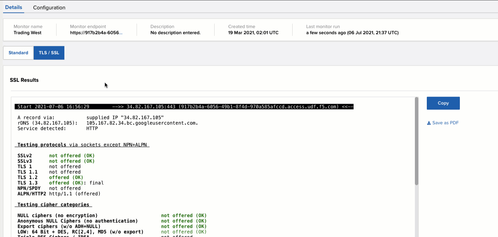

# 04-26-2021

## Beacon Notifications

- Ability to send application health notification events to MS Teams, Slack, Email, or Generic Webhook endpoints.
- Control which application or components send notifications
- Control when events cause notifications (Critical, Warning, Healthy, etc)

## Insight Filters

- Search Filter field added to Source Type, Metric, and Filter columns.
- Ability to narrow down selection based on known values.

## TLS Report Copy Button

- Easily copy the TLS report including formatting.
- Paste into chats, emails, etc.

