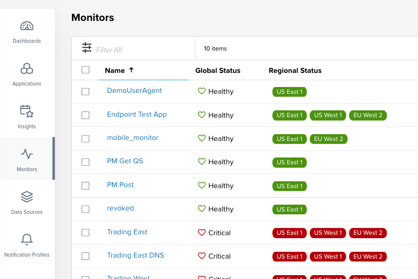
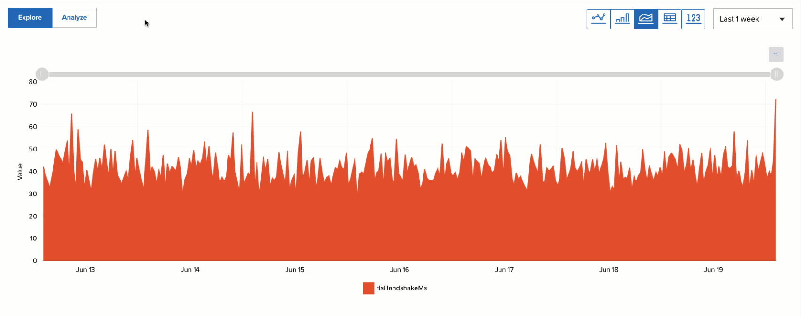

# 06-07-2021

## Streamlined Navigation

- Quickly navigate to the parts of Beacon that matter the most using refreshed menu on the left side.
- The Monitors page displays by default when initially navigating to Beacon.

## Analyze Insights and Health Conditions

- Ability to analyze any metric from an insight
- Beacon will suggest a warning and critical threshold for a given metric
- Ability to adjust the thresholds with either a graphical slider or a text box
- Customize the messaging for a given threshold violation
- Insight health can be associated with any component in an application topology

