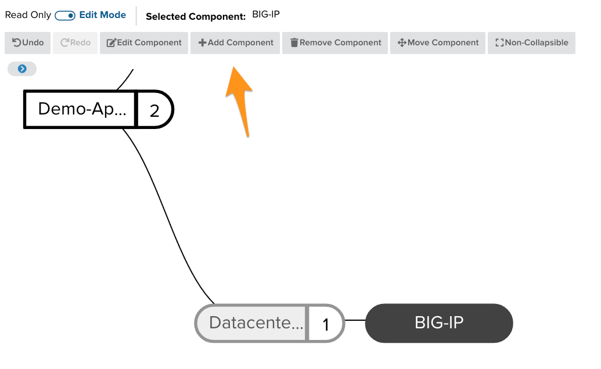
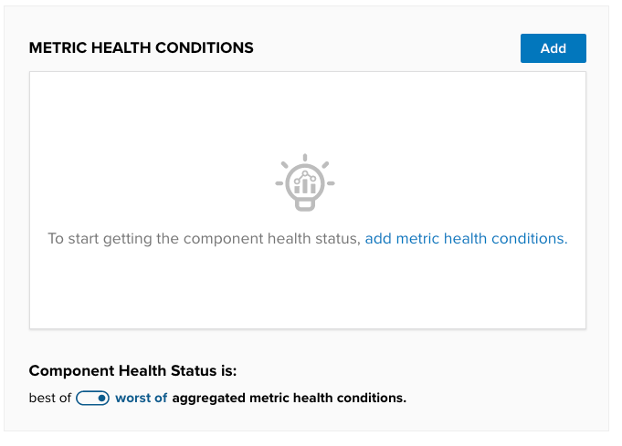
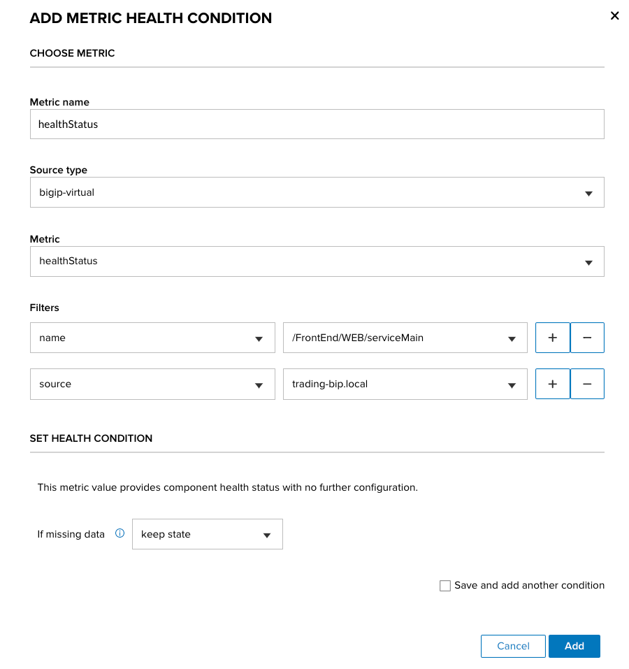
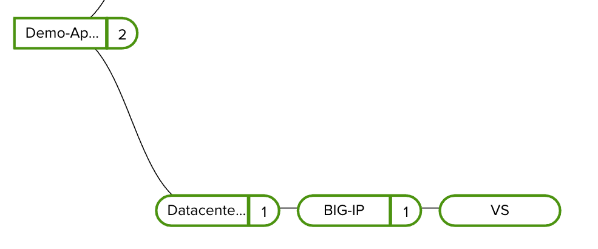
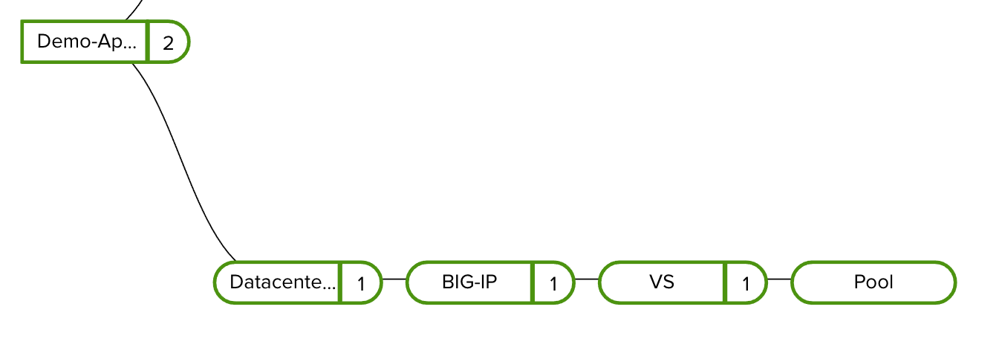

# BIG-IP Object Health

Most application data paths travel through an ADC controller. These controllers calculate health on their own, many times using monitors towards the internal orgin servers. Once you connect your BIG-IP environment into Beacon you can then associate applications with specific objects such as **Virtual-Servers** and **Pools**. The health of the Beacon component will default to the health of the BIG-IP object.
- Map a BIG-IP Virtual-Server to a Beacon Component within an application.
- Map a BIG-IP Pool to a Beacon Component within an application.

## Associate a Virtual

1. Navigate to the **Applications** page and select the application you would like to associate with the monitor.
1. Enter **edit** mode for the application and select the Component you would like to use as the parent of your Virtual-Server.

   For this example we have a `Demo-App` and have selected a pre-configuered `BIG-IP` component.

1. Select `Add Component` in the edit menu.

   

1. Name your component in the opened form and then select `Continue`. (We named ours **VS**)

1. On the next tab, under **Metric Health Conditions**, select `Add`.

   This allows you to associate metrics that have been ingested into Beacon with the application component. In this case we will be associated the health of a BIG-IP Virtual-Server.

   

1. Select the following values for the form to associate with your Virtual-Server and then select **Add** in the bottom right.

   - Source Type: **bigip-virtual**
   - Metric: **healthStatus**
   - Filters:
     - name: **name-of-your-virtual-server**
     - source: **name-of-your-bigip**

   

   ?> It is best practice to associate enough filters to a metric to ensure that it is unique. In the example above, you could get away with only filtering based on **name** of the object, but if two BIG-IPs had the same virtual name, then it would aggregate the health of both virtuals.

   Select `Add` for the Metric-Health-Condition, then `Save` for the component, and then finally `Save` for the entire application in the top right.

1. After the application saves, you will need to toggle out of **edit** mode in the top right. If you new component still shows with no health, you may need to wait a minute and then refresh the app page after Beacon has calculated the new health.

   

## Associate a Pool

1. Add a new component under the **Virtual** you just created to represent your pool. We will name this one **Pool**. Reference the initial steps above for adding a new child component.

1. Add a **Metric Health Conditions** to the pool component with the parameters below:

   - Source Type: **bigip-pool**
   - Metric: **healthStatus**
   - Filters:
     - name: **name-of-your-pool**
     - source: **name-of-your-bigip**

  Select `Add` for the Metric-Health-Condition, then `Save` for the component, and then finally `Save` for the entire application in the top right.

1. After the application saves, you will need to toggle out of **edit** mode in the top right. If you new component still shows with no health, you may need to wait a minute and then refresh the app page after Beacon has calculated the new health.

   

The health of your Beacon Virtual and Pool component now rely on what is ingested from your BIG-IP. If the health changes on the BIG-IP it will be updated in the Beacon application for correlation with other components.