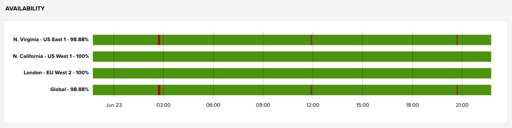
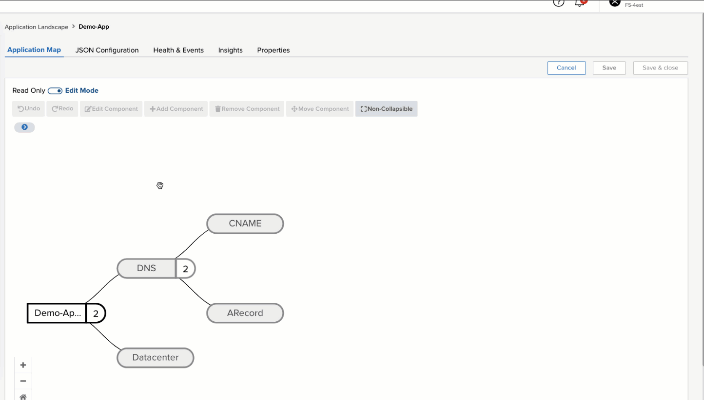

# Monitor CNAME to CDN

It is a common deployment pattern to have the initial DNS request to an application have its record return a **CNAME** which then targets a **CDN**.  In this example we will:
- Create a Beacon synthetic DNS monitor to check for a valid response to a CNAME query from multiple regions.
- Associate the health of this monitor with our application.

## Create the Monitor

1. Navigate to **Monitors** in the left hand menu and then select **Create >> DNS Monitor**

   - Add a domain to monitor that returns a CNAME
   - Give the monitor a Name (this can be used to reference the unique monitor in the future)
   - Select different regions around the world to perform the monitor from:
     - Each region will provide its own health and latency as well as an aggregate global value

   

1. Initially the monitors will appear gray until the first round of checks have completed. You can refresh your browser after about 1m to see the updated status.

   ?> **FYI** Please keep in mind that if it is a new monitor, there may be only a few data points visible. The example below has been allowed to run for over a day.

   - To review the monitor, select the row to have a summary slide-out including average global health and metrics.
   - Select **View details** in the botton right to drill into the health, latency, and events of the monitor.

   

## Associate to an App

1. Navigate to the **Applications** page and select the application you would like to associate with the monitor.
1. Enter **edit** mode for the application and select the component for which you would like to associate the new CNAME monitor.

   For this example we have a `Demo-App` with a component meant to represent the health of the CNAME part of the application.

1. Select `Edit Component` 

   - In the slide-out menu select `continue` on the first page.
   - On the second page under `METRIC HEALTH CONDITIONS` select `Add` and fill in the follow attributes:
     - Source Type: **dns-monitor**
     - Metric: **healthStatus**
     - Filters:
       - source: **name-of-your-monitor**

   

   Select `Add` for the Metric-Health-Condition, then `Save` for the component, and then finally `Save` for the entire application as in the gif below.

   ?> If Beacon has not yet calulated the health for the application, make sure to exit **Edit Mode** in the top level and then try refreshing the page.