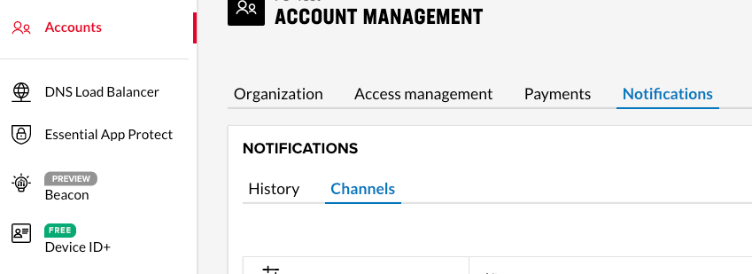
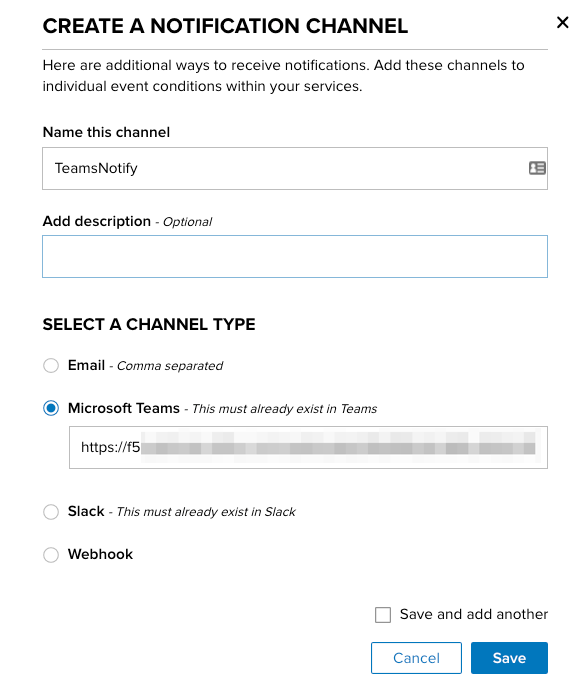
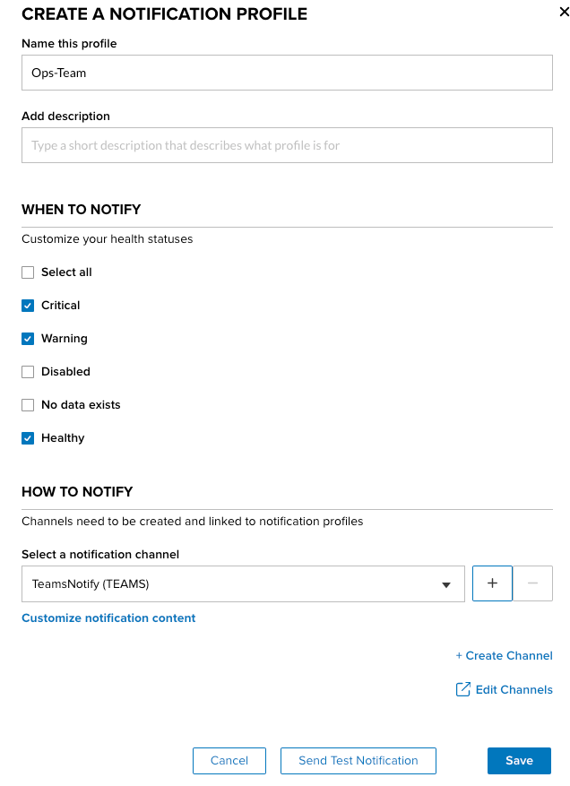
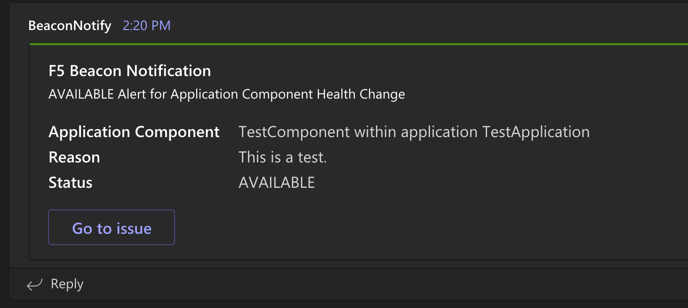
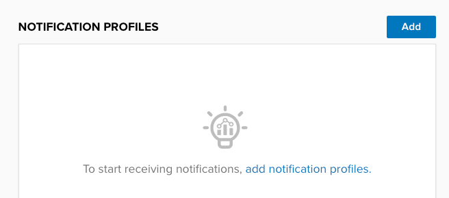
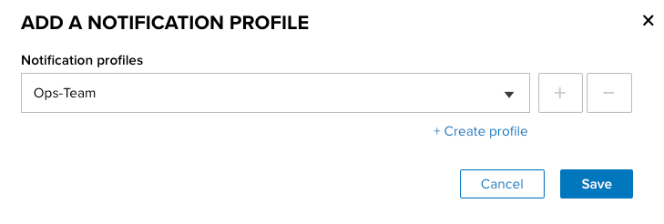
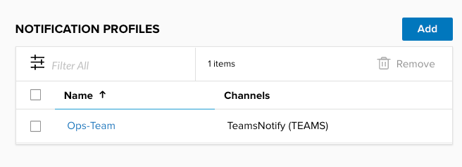
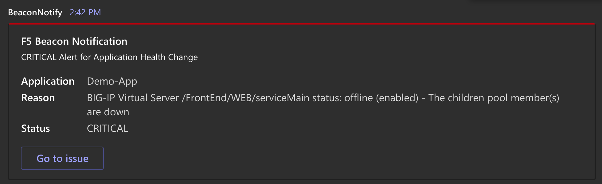
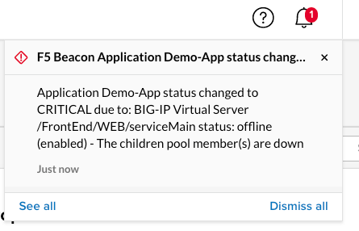
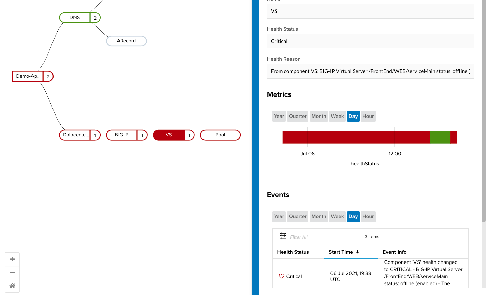

# Outage Notification

Since we are not all watching dashboards throughout the day, it is important to have notifications sent out **when** and **where** it is important to you. In this example we will configure Beacon to send us a **MS Teams** notification when our application changes state. This same workflow works with any notification destination such as **Email**, **Teams**, **Slack**, **generic webhoook**, etc.

Additional Examples
- When a HTTP/DNS monitor associated with an application fails.
- When exipry of a TLS/SSL certificate falls below a specified number of days.
- When the number of service nodes drops to a single point of failure.
- When blocks on your WAF/FW go beyond a normal level.
- When number of connections to a Database exceeds a known level.
- When any metric goes out of normal levels.

## Channel Creation

A channel in Beacon represents **where** to send the notification once it is triggered.

1. Navigate to `Accounts >> Notifications >> Channels` and then select **Create**.

   

1. Name your channel, select the type, fill in the appropriate destination information, and select **Save**.

   In this example we are using a MS Teams channel as the destination and place the URL in the field as below. See - [Teams Setup](https://docs.microsoft.com/en-us/microsoftteams/platform/webhooks-and-connectors/how-to/add-incoming-webhook)

   

   We now have our channel destination created and ready to be used by a notification profile.

## Profile Creation

A notification profile controls **when** to send a notification, which **channel(s)** to send to, and the formatting of the message to send. It can then be associated with one or more applications/components.

1. Navigate to `Beacon >> Notification Profiles` and then select **Create**.

1. Our profile is going to send to the Operations team so we named it "Ops-Team". We also only want to be notified on a **Warning**, **Critical**, or **Healthy** event. Finally we tell the profile to send notifications to the **Channel** we created in the previous step.

   

   ?> You can optionally customize the content of the notification if a specific format or wording is needed using the **Customize notification content** option in the dialogue.

1. While the create diaglogue is still open, select **Send Test Noticication** at the bottom and ensure your endpoint gets the test that is sent out.

   Below is what was received in our Teams channel.

   

1. Select **Save** for the profile.

## App Association

Finally we need to associate the new profile with an application or component. We want notifications to be sent if any part of the application goes down so we are going to associate the profile with top/root component.

1. Navigate to `Applications` and edit the app that you would like to receive notifications for.

1. Select the top level component and click **Edit Component**.

1. Slect **Continue** on the first edit tab.

1. Within the **Notification Profiles** section of the slide-out, select **Add**.

   

1. In the dropdown, select the new profile you just created and select **Save**

   

   

1. **Save** the component, and then the entire application.

1. Our demo application has a BIG-IP pool associated with it and we just setup a monitor to fail on that pool.

   - Telemetry Streaming sends the down state to Beacon.
   - Beacon updates the health of the Pool and then the associated App within the portal.
   - Since we associated a notification profile with the top level of the app, one is send to the Teams channel as below:

## Getting Notified

1. In Teams we got the following notification.

   

1. Within the portal, we can also see the notification in the top right.

   

1. If we drill into the application we can see the reason for the event when selecting the component in the event info.

   