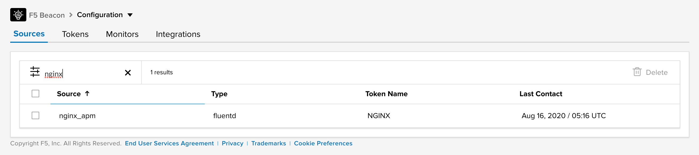

# Application Performance Monitoring with NGINX

This example extends Rick Nelson's post [Using NGINX Logging for Application Performance Monitoring](https://www.nginx.com/blog/using-nginx-logging-for-application-performance-monitoring/) by describing how to feed log data from NGINX to Beacon via Fluentd.

## Pre-requisites

This post assumes one or more NGINX-hosted applications already exist and Fluentd is already running and has access to the NGINX logs.  If you're looking for guidance around installation and setup, refer to the documentation for [NGINX](https://www.nginx.com/) and [Fluentd](https://docs.fluentd.org).

## Update NGINX logging configuration

The below is an example log format containing some NGINX timing variables.  We use JSON formatting to enable consumption via Fluentd without the use of additional parsing plugins.

```
log_format apm escape=json
    '{'
        '"client":"$remote_addr",'
        '"request":"$request",'
        '"request_length":$request_length,'
        '"bytes_sent":$bytes_sent,'
        '"body_bytes_sent":$body_bytes_sent,'
        '"referer":"$http_referer",'
        '"user_agent":"$http_user_agent",'
        '"upstream_addr":"$upstream_addr",'
        '"upstream_status":$upstream_status,'
        '"request_time":$request_time,'
        '"upstream_response_time":$upstream_response_time,'
        '"upstream_connect_time":$upstream_connect_time,'
        '"upstream_header_time":$upstream_header_time'
    '}';

access_log /var/log/nginx/apm.log apm;
```

Once enabled, JSON should be visible in the log for processed requests:

```
# tail /var/log/nginx/apm.log
{"client":"192.0.2.59","request":"GET / HTTP/1.1","request_length":599,"bytes_sent":3433,"body_bytes_sent":2855,"referer":"","user_agent":"Mozilla/5.0 (Macintosh; Intel Mac OS X 10_15_5) AppleWebKit/537.36 (KHTML, like Gecko) Chrome/84.0.4147.105 Safari/537.36","upstream_addr":"198.51.100.12:80","upstream_status":200,"request_time":0.060,"upstream_response_time":0.056,"upstream_connect_time":0.000,"upstream_header_time":0.056}
{"client":"192.0.2.59","request":"GET /favicon.ico HTTP/1.1","request_length":575,"bytes_sent":674,"body_bytes_sent":157,"referer":"http://203.0.113.57:8080/","user_agent":"Mozilla/5.0 (Macintosh; Intel Mac OS X 10_15_5) AppleWebKit/537.36 (KHTML, like Gecko) Chrome/84.0.4147.105 Safari/537.36","upstream_addr":"198.51.100.12:80","upstream_status":302,"request_time":0.191,"upstream_response_time":0.192,"upstream_connect_time":0.048,"upstream_header_time":0.192}
```

## Add the NGINX log as a Fluentd input

Update the Fluentd configuration to include the NGINX log as a source.  This example uses the core Fluentd [tail input plugin](https://docs.fluentd.org/input/tail).

```
<source>
  @type tail
  @id nginx_apm_log
  path /var/log/nginx/apm.log
  pos_file /var/log/fluent/nginx_apm_log.pos
  <parse>
    @type json
  </parse>
  tag nginx.apm
</source>
```

## Connect the NGINX log to a Beacon output

If you haven't already, you'll need to install the [Beacon output plugin](https://github.com/f5devcentral/fluent-plugin-f5-beacon).  After installation, it can be matched with the NGINX log data:

```
<match nginx.apm>
  @type f5_beacon
  @id f5_beacon
  auto_tags true
  source_name nginx_apm
  token <Beacon Access Token>
</match>
```

Be sure to replace *<Beacon Access Token>* with a valid token for your Beacon account.  Restart Fluentd after making the configuration changes to start the data flowing.

The Fluentd log should show:

```
2020-08-15 06:50:22 +0000 [info]: #0 [f5_beacon] starting F5 Beacon plugin...
2020-08-15 06:50:22 +0000 [info]: #0 [nginx_apm_log] following tail of /var/log/nginx/apm.log
```

## See the data in Beacon

As applications process requests, the log entries should flow through Fluentd and on to Beacon.  Note that buffering occurs within Fluentd and the default flush interval is one minute.  Once data is received and processed via Beacon, the source name configured in the Fluentd configuration above should be visible on the Beacon Sources page:



Details for the data received is visible when creating an insight:


The data should align with the JSON visible in the log file.  Because `auto_tags` was enabled in the Fluentd configuration, the numeric values were translated to fields (in the column labeled "Metric") and the others were translated to tags (in the column labeled "Filter").

The data can then be queried to generate insights into the applications.  In this example, request times are compared between two separate upstream servers:


## Troubleshooting

If data fails to appear in Beacon the NGINX and Fluentd logging appears normal, you can increase the log level for the Beacon plugin in the Fluentd configuration:

```
<match nginx.apm>
  @type f5_beacon
  @id f5_beacon
  @log_level debug
  auto_tags true
  source_name nginx_apm
  token <Beacon Access Token>
</match>
```

At the `debug` level, the plugin will log a message on writes to Beacon:

```
2020-08-16 06:15:29 +0000 [debug]: #0 [f5_beacon] sending data to Beacon
2020-08-16 06:16:35 +0000 [debug]: #0 [f5_beacon] sending data to Beacon
2020-08-16 06:17:35 +0000 [debug]: #0 [f5_beacon] sending data to Beacon
2020-08-16 06:18:41 +0000 [debug]: #0 [f5_beacon] sending data to Beacon
2020-08-16 06:19:46 +0000 [debug]: #0 [f5_beacon] sending data to Beacon
```

At the `trace` level, the plugin will also log the payload sent to Beacon:

```
2020-08-16 06:23:19 +0000 [debug]: #0 [f5_beacon] sending data to Beacon
2020-08-16 06:23:19 +0000 [trace]: #0 [f5_beacon] nginx.apm,client=192.0.2.59,request=GET\ /\ HTTP/1.1,user_agent=curl/7.58.0,upstream_addr=198.51.100.12:80,beacon-fluent-source=nginx_apm request_length=78i,bytes_sent=9617i,body_bytes_sent=8802i,upstream_status=200i,request_time=0.126,upstream_response_time=0.128,upstream_connect_time=0.044,upstream_header_time=0.084 1597558939276388902
```