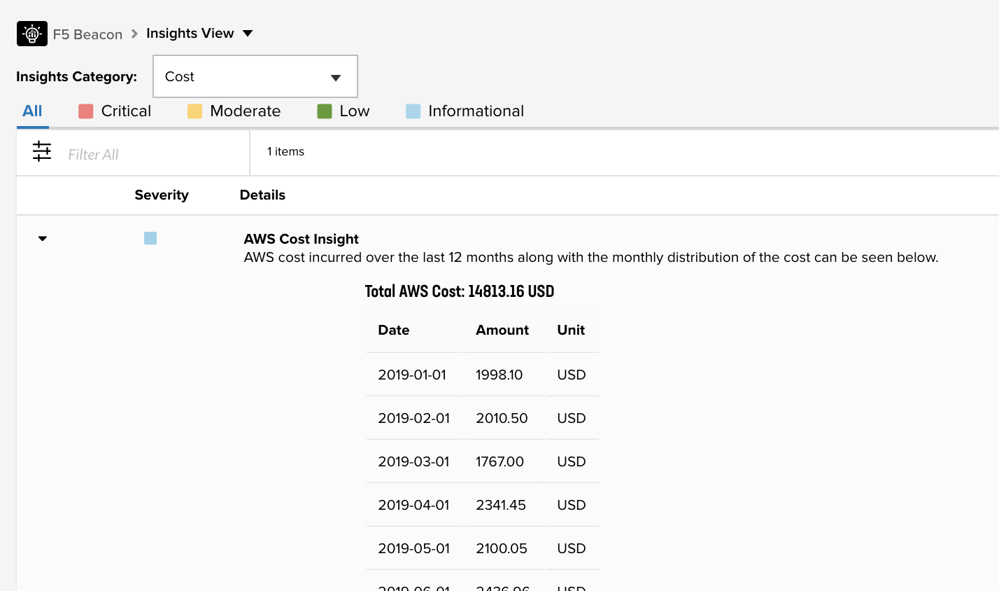
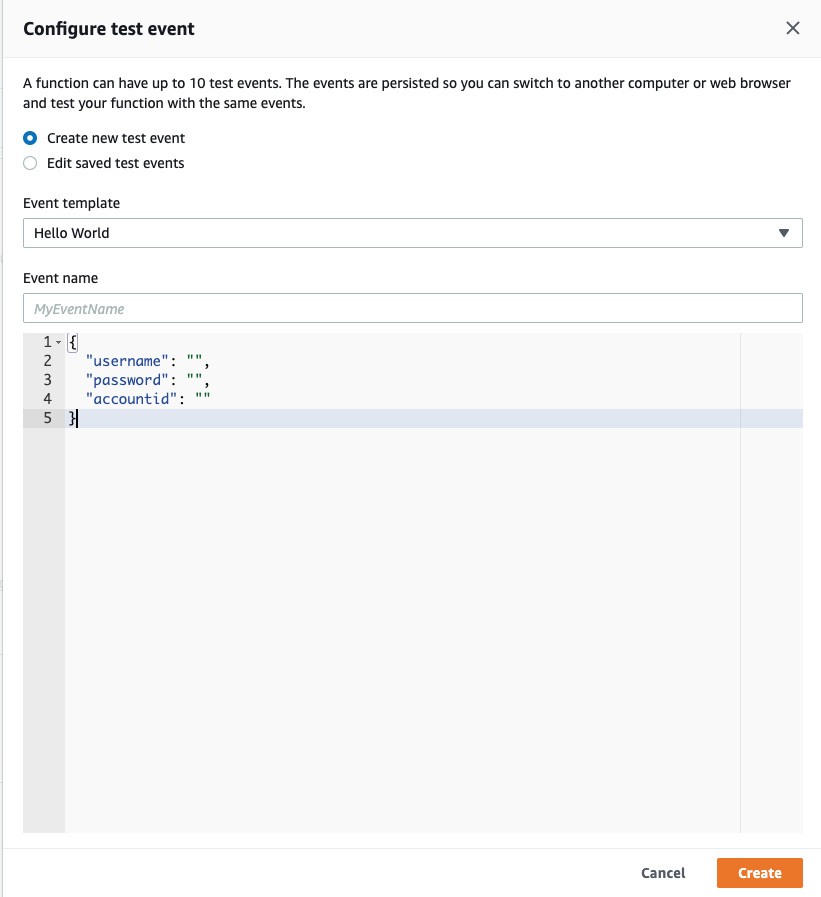
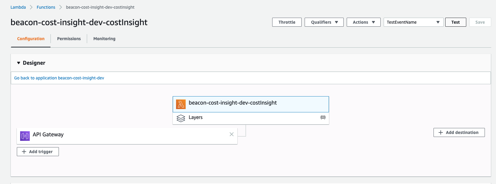

# AWS Cost Insight

F5 Beacon provides a centralized location(Insights View) to get insightful information about an application's ecosystem.
These insights are categorized into Cost, Operations or Security. AWS Cost Insight is one of the examples which fall under the Cost Category and using the lambda can directly be imported into F5 Beacon's Insights View.



## Publish AWS Cost Insights using Beacon Cost Insight lambda example

### Giving Access to Billing Information

Access to AWS Billing Information has been given by setting the IAM Role Permission in file `serverless.yml`.  
By default **Full Access** has been provided to AWS Cost Explorer. You can update the `iamRoleStatements` in `serverless.yml` file to change permissions.

```
iamRoleStatements:
    - Effect: "Allow"
      Action:
        - "ce:*"
      Resource:
        - "*"
```
### Cost Insight

In this section, we will detail how to utilize the F5 Beacon Insights API to build a Cost Insight using AWS.
We will utilize an AWS Lambda function to query Beacon Insights API and update the total AWS Cost incurred over the past 12 months as well as monthly distribution. 

In this example we will build a Lambda function in NodeJS with the following entry point in `costInsight` handler function:

```
    module.exports.costInsight = async event => {
    
     ...
     
    }
```

The handler function describes the main operations of the Lambda function:
* **Login** - Login to F5 Cloud Services to obtain an API token
* **Get AWS Cost Information** - Using AWS Cost Explorer to get Cost incurred
* **Create Cost Insight** - Create an insight struct
* **Publish Insight** - Publish the insight to Beacon

### Log in

The Lambda function is logging in to F5 Cloud Service.
The 'Username', 'Password' and 'Preferred account-id' are used to authenticate and execute API calls against Beacon, which are then provided in the Lambda function JSON input.
The JSON input fields are defined as below:

```
    {
       "username": "",
       "password": "",
       "account": ""
     }
```

### Get AWS Cost Information 

To get the cost information from AWS, we use AWS Cost Explorer. We can set edit the cost parameters using `costParams` to get tailored information according to the needs.
As default, Granularity has been set to a month, and metrics being pulled is Amortized Cost.

```
    function getCost(StartDate, EndDate) {
        var costexplorer = new AWS.CostExplorer();

        var costParams = {
            TimePeriod: {
                End: EndDate,
                Start: StartDate
            },
            Granularity: 'MONTHLY',
            Metrics: ['AmortizedCost']
        };

        return new Promise((resolve, reject) => {
            costexplorer.getCostAndUsage(costParams, function (err, data) {
                if (err) {
                    reject(err);
                } else {
                    resolve(data);
                }
            })
        });
    }
```

### Create Cost Insight

After the cost has been pulled, the insight is generated. This is done so that different parameters like 'title', 'description', 'category', 'severity', and 'markdownContent' can be set. 
the parameter 'markdownContent' is where the AWS cost is used to display it in a tabular fashion. 

```
    function createInsight(CostArray) {
        var MarkdownContent = "| Date | Amount | Unit |\n| :--- | :--- | :---- |\n";
        return new Promise((resolve) => {
            var totalCost = 0;
            const unit = CostArray.length > 0 ? CostArray[0].Total.AmortizedCost.Unit : 'USD';
            CostArray.ResultsByTime.forEach(result => {
                totalCost += Number(result.Total.AmortizedCost.Amount);
                MarkdownContent = MarkdownContent + `| ${result.TimePeriod.Start} | ${Number(result.Total.AmortizedCost.Amount).toFixed(2).toString()} | ${result.Total.AmortizedCost.Unit} |\n`;

            });
            totalCost = totalCost.toFixed(2);
            MarkdownContent = `\n ##### Total AWS Cost: ${totalCost} ${unit} \n` + MarkdownContent;
            const created_insight = {
                title: "AWS Cost Insight",
                description: `AWS cost incurred over the last 12 months along with the monthly distribution of the cost can be seen below.`,
                markdownContent: MarkdownContent,
                category: "INS_CAT_COST",
                severity: "INS_SEV_INFORMATIONAL"
            };
            resolve(created_insight);
        });
    } 
```

### Publish Insight

Finally, the insight is published to the F5 Beacon, and is then available in the Insights View page.

```
    function publishCostInsight(createdInsight, accountid) {
        let options = {
            body: createdInsight,
        };

        options.uri = '/insights';
        options.method = "POST";
        if (accountid) {
            options.headers = {
                'X-F5aas-Preferred-Account-Id': accountid
            };
        }

        return new Promise((resolve) => {
            resolve(
                self.rpWithAuth.post(options)
            );
        });

    }
```

### Deploy Code to AWS

Code can be deployed to AWS using the command below:

```
   $ severless deploy
```

or 

```
    $ sls deploy
```

* Default stage has been configured to `dev`. This can be changed by using the flag `--stage` or `-s` to set the stage in the service.
* Default region has been set to `us-east-1`. This can be changed by using the flag `--region` or `-r`.

For example, 
```
    $ severless deploy --stage production --region eu-central-1
```

Once uploaded, you can then set the credentials and preferred account as input.



The code can then be executed.



The results can be checked in F5 Beacon under the Insights Page.

